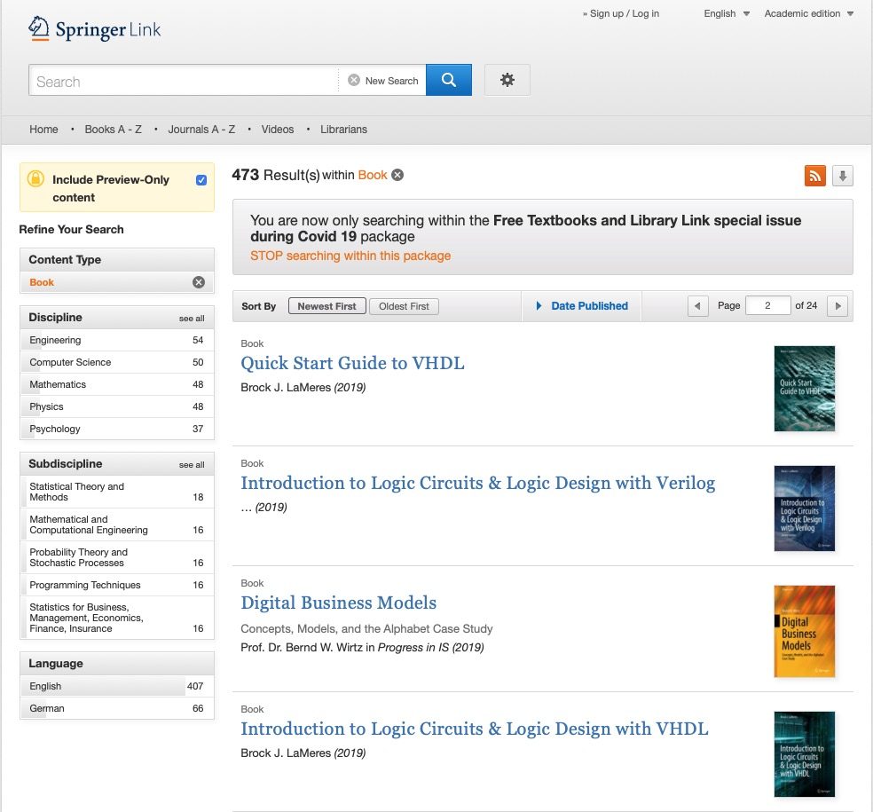
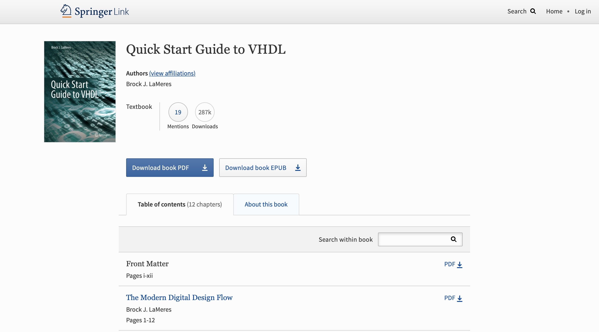
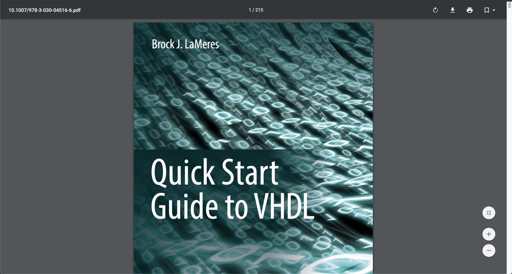
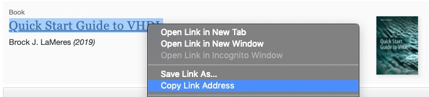
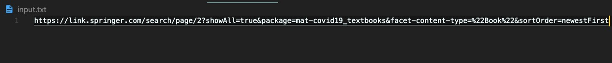

# books-downloader-Python
Python program that allows you to download with ease books from the Springer webpage.

## Requirements:<br>
- This folder
- [Pyhton interpreter](https://www.python.org/downloads/)
- [Selenium Python library](https://selenium-python.readthedocs.io)
- [Requests Pyhton library](https://requests.readthedocs.io/en/master/)
- [Google Chrome Driver](https://chromedriver.chromium.org/downloads) depending on your Google Chrome version<br>
- [Google Chrome](https://www.google.com/chrome/) installed in your PC

Note: Python dependencies are defined in requirements.txt and everything is explained below.


Hi 😃,
"Springer" publisher allows you to download > 500 books in PDF format from its official web page for free.

This is the [webpage](https://link.springer.com/search/page/2?showAll=true&package=mat-covid19_textbooks&facet-content-type=%22Book%22&sortOrder=newestFirst)

You can download files using two different approaches:

Mehtod 1 -> Manual download
Mehtod 2 -> Semmi-automatic download (Recommended jeje)


## METHOD 1<br>
If you want to download some books, you go to their webpage and click on every book you are interested in and follow a manual download approach.
This involves the following steps:<br>
1.) go to [Springer Webpage](https://link.springer.com/search/page/2?showAll=true&package=mat-covid19_textbooks&facet-content-type=%22Book%22&sortOrder=newestFirst)



2) For every book you are interested in, do the following (example with a random book):<br>
 2.1) Click in the link of the book (in my example click in "Quick Start Guide to VHDL")
    
 2.2) The Book details page will appear

    
 2.3) Click the "Download book PDF" blue botton

 2.4) A new tab with the Book in pdf format will appear. Now you can download the file.



If your are downloading few books, this is not much effort but if you are found of technical books and want to download many books, you will find yourself a little bit frustrated after the tenth (random number xD) download.

That's why I created this Python program that allows you to download the books saving you a lot of time. The set up process is easier than it seems.
What you have to do is follow the Mehtod 2:

## METHOD 2<br>
You can follow the instructions below. I also created this video to help you. I encorauge you to watch the video.
TODO add link to youtube video.

2.1) Download this github folder.

2.2) Go to https://sites.google.com/a/chromium.org/chromedriver/downloads
    and download the driver depending on your Google Chrome Version (to know your version, open Google Chrome and go to Chrome -> About Google Chrome or similar).
    
    Save the corresponding zip into this folder. Extract the file and rename the extracted file to "chromedriver" (if it has a different name). Now you can delete the .zip file.
    
2.3) Open a Terminal and navigate to this folder.
    
2.4) Create a new virtual environment and install dependencies:
    
```
    python3 -m venv env
    source env/bin/activate
    pip install requirements.txt 
```

2.3) Go to [Springer webpage](https://link.springer.com/search/page/2?showAll=true&package=mat-covid19_textbooks&facet-content-type=%22Book%22&sortOrder=newestFirst)
   


2.4) For every book that you find interesting, right click on the book name and select "Copy link address"



2.5) Open the file "input.txt" (or create it in this folder with the exact same name if it doesn't exist) and paste the copied link in a new line



2.6) Repeat steps 2.4 and 2.5 for all the books you want to Download (remember to Paste each new link in a new line of the "input.txt" file).
    Save the "input.txt" file.

2.7) Go to the terminal (you will need to be in this folder) and execute

```
python3 download_Springer_books.py
```

2.8)    Enjoy your books 👓

Cheers!
